# Can LLMs Classify Time Series Data?
## Abstract
The increasing prevalence of time-series data across domains, such as healthcare, finance, and IoT, has driven the need for flexible and generalizable modeling approaches. Traditional time-series analysis relies heavily on supervised models, which suffer from data scarcity and high deployment costs. This project explores the potential of Large Language Models (LLMs) as general-purpose few-shot learners for time-series classification tasks. Specifically, we investigate how different input representations affect LLM performance in two representative tasks: Dual-Tone Multi-Frequency (DTMF) signal decoding and Human Activity Recognition (HAR). By comparing text-based, visual, and multimodal inputs across models including GPT-4o, GPT-o1, and DeepSeek-R1, we assess their reasoning capabilities and robustness. Our findings show that while LLMs demonstrate potential, performance significantly varies depending on input representation and model type. In DTMF, GPT-o1 and DeepSeek-R1 consistently outperforms GPT-4o, particularly in tasks requiring text-based numerical reasoning. In HAR, visualization aids interpretation, and few-shot learning significantly boosts performance. However, challenges remain, especially in precise plot reading, domain knowledge retrieval (GPT-4o), and multimodal integration. Further domain-specific enhancements and robust representation strategies are heavily required for current LLMs. Code for this project is available on [https://github.com/nesl/LLM_time_series](https://github.com/nesl/LLM\_time\_series).


## Content
- [Can LLMs Classify Time Series Data?](#can-llms-classify-time-series-data)
  - [Abstract](#abstract)
  - [Content](#content)
  - [1. Introduction](#1-introduction)
  - [2. Related Works](#2-related-works)
    - [2.1 DTMF Prediction](#21-dtmf-prediction)
    - [2.2 Prompt Engineering](#22-prompt-engineering)
    - [2.3 Multimodal Large Language Models (MLLMs)](#23-multimodal-large-language-models-mllms)
  - [3. DTMF Experiments and Analysis](#3-dtmf-experiments-and-analysis)
    - [3.1 Experimental Settings](#31-experimental-settings)
    - [3.2 Results](#32-results)
    - [3.3 Conclusion of DTMF](#33-conclusion-of-dtmf)
  - [4. Human Activity Recognition (HAR) Experiments and Analysis](#4-human-activity-recognition-har-experiments-and-analysis)
    - [4.1 Methods](#41-methods)
    - [4.2 Results](#42-results)
    - [4.3 Conclusion of HAR](#43-conclusion-of-har)
  - [5. Conclusion](#5-conclusion)
  - [References](#references)


## 1. Introduction
Time series data is prevalent across various domains, including finance, traffic, healthcare and IoT. It makes up diverse downstream tasks including classification, forecasting, anomaly detection, and time series generation. These tasks were originally tackled with classical statistics models, such as ARIMA, ARCH[[7]](#7), and Markov model[[10]](#10). With the development of deep neural networks, CNNs[[5]](#5) [[19]](#19) [[36]](#36), RNNs[[18]](#18), Transformers[[29]](#29) and other deep architectures have been emerged in and tailored for time series. These methods greatly improved the model’s ability in understanding complex signals; however, they are basically supervised learning demanding for training data.  

Many domains face high costs and privacy concerns when collecting large-scale training data, limiting the performance of supervised models. Additionally, these methods require separate training for each task, making them inflexible and costly to deploy across diverse time series applications.

Recent breakthroughs in Large Language Models (LLMs) provide a potential solution for these problems. LLMs have been proven to be powerful in tackling words series, and some works[[20]](#20) also proven their abilities for general pattern recognition in addition to language, raising the hypothesis that they could be effective for time series tasks as well. Their strong zero-shot learning ability and extensive knowledge may mitigate data shortage issues and enable easy adaptation to various downstream tasks without the need for retraining specialized models. Some researches have explored the application of LLMs for time-series analysis. [[12]](#12) [[27]](#27) [[33]](#33)[[35]](#35) comprehensively summarized recent works of language models for various downstream time series tasks. TimeGPT[[8]](#8), ForecastPFN[[6]](#6), Lag-LLaMA[[24]](#24) are foundation models for time series pretrained from scratch with powerful zero-shot learning and generalization abilities. GPT4TS[[37]](#37), LLM4TS[[4]](#4), Time-LLM[[13]](#13), TEMPO[[3]](#3) and IoT-LM[[21]](#21) embed LLMs as a frozen component within trainable time-series specific model architecture, enabling the model to address unique challenges of time-series analysis while leveraging LLMs' strong reasoning capabilities and wide preexisting knowledge. These approaches are proved effective but add additional training burden on time-series data. Given the strong ability of general pattern recognition of recent LLMs, some works directly query LLMs to analyze time-series data without any specific finetune or training[[1]](#1) [[9]](#9) [[11]](#11) [[16]](#16) [[22]](#22) [[32]](#32). Compared to other methods, directly querying has no requirements about LLMs and can use both open-soured and close–sourced models. Besides, it can easily generalize to almost all data types and downstream tasks without extra training.

However, current LLMs are sensitive to prompts, making it tricky to design the input. This project explores how well can LLMs deal with time series data in classification tasks as well as their performance across various input representations. Specifically, this project tries to answer the following two questions:
1. How do different input representations affect the performance of LLMs (e.g., raw time series values in text, natural language description, plots of raw data, etc.)?
1. To what extent can LLMs serve as a general-purpose model for different time-series inputs and tasks?

To explore these questions, we select two representative tasks with varying complexity and domains: Dual-Tone Multi-Frequency (DTMF) signal decoding and Human Activity Recognition (HAR). DTMF decoding aims to recover dialed numbers from structured audio signals, providing a controlled setting to assess LLMs' capabilities for time series in theory. HAR requires classifying human activities based on time series data from multimodal sensors. It is more prevalent and less structured in real-world, evaluating the LLMs' performance in practice.

## 2. Related Works 
### 2.1 DTMF Prediction
Dual-Tone Multi-Frequency (DTMF) signals represent digits through a combination of high- and low-frequency tones, where each digit corresponds to a fixed frequency pair. While classical approaches such as Fourier Transform are effective, using LLMs offers an opportunity to explore their preliminarily reasoning abilities over time-series and frequency-series data using natural language instructions.

### 2.2 Prompt Engineering
Prompt engineering is critical to unleash the potential of Large Language Models. By crafting effective prompts, researchers can guide LLMs to perform specific tasks without modifying the model’s underlying parameters. This approach is particularly beneficial for time series tasks, where data may be scarce or labeling expensive.

Researchers have proposed many practical prompt engineering techniques to enhance models from different aspects[[25]](#25). Zero-shot prompting[[23]](#23) allows LLMs to perform tasks without any task-specific training data. The model relies on task instructions and its pre-trained knowledge to generate predictions. On top of it, few-shot prompting[[2]](#2) further assists the model to adapt to new tasks through a few high-quality input-output examples. Despite the outstanding content generation performance, LLMs often struggle with complex reasoning. Chain-of-Thought (CoT)[[28]](#28) bridges this gap by prompting the model to think in a structured and step-by-step way. To alleviate hallucination, Retrieval Augmented Generation (RAG)[[15]](#15) integrates domain knowledge in addition to LLMs priori knowledge.

Time series analysis has benefited from these general prompt engineering techniques. PromptCast[[32]](#32) and LLMTime[[9]](#9) insert numerical data into natural language prompt to forecast future data with LLMs. This simple and straightforward approach yields impressive results. SenseLLM[[22]](#22) and LLMSensor[[16]](#16) utilize multi-step LLM callings that first require the LLM to analyze the sensor data trend, and then make predictions based on the raw data and analysis of the trend of the data. HARGPT[[11]](#11) simplifies this process by using Chain-of-Thought in only one LLM call. IoT-LLM[[1]](#1) enhances large language models in diverse time series tasks by adding a domain knowledge retrieval module. These works reveal great potential of general LLMs as zero-shot time series analyzer.

### 2.3 Multimodal Large Language Models (MLLMs)
The rapid progress of multimodal language models, especially visual-language models (VLMs) has introduced new possibilities for time series analysis by integrating sensor signals, images, and textual prompts within a unified framework. MLLMs benefit from jointly processing and reasoning over diverse modalities, thus improving interpretability and generalization. Xu et al.[[31]](#31) present a comprehensive overview of MLLMs in time series analysis, covering a wide range of modalities including text, images, graphs, audios, and tables. Specifically, transferring time series into images is easy, and visual representation of time series is more robust for abnormal data.

The idea of visualizing time series data has earlier proposed in some works that adopt Convolutional Neural Networks (CNNs)[[14]](#14) [[26]](#26) and Vision Transformer (ViT)[[17]](#17), inspiring modern approaches to visualize time series inputs for LLM-based reasoning. Wu et al.[[34]](#34) transforms sensor data into images to leverage the image understanding capabilities of MLLMs. Xu et al.[[30]](#30) investigate the performance of MLLMs on visualized time series data in anomaly detection. These researches show that visualization is a promising strategy for LLMs to handle complex temporal data. In this project, we explore how well can LLMs tackle time-series data in visual form for DTMF and HAR tasks.

## 3. DTMF Experiments and Analysis
We conduct experiments on DeepSeek-R1, GPT-4o, and GPT-o1 to represent the current landscape of LLMs. These popular large language models vary in their capabilities, ranging from language-only to vision-language, and from non-reasoning to reasoning architectures. DeepSeek-R1 only takes textual input, so all experiments with visual input are only conducted on GPT-4o and GPT-o1.

### 3.1 Experimental Settings
Due to the lack of existing phone number datasets, the DTMF dataset is generated by python[^1] with sample frequency of 15,000Hz. Each tone lasts for 80 milliseconds with an interval of 100 milliseconds in between. To test the model robustness, normally distributed random noises is added during generation additionally.


> Code for generation: [dtmf-generator.py](https://github.com/nesl/LLM_time_series/blob/master/dtmf-generator.py)  
> Dataset: [without noise](https://github.com/nesl/LLM_time_series/tree/master/datasets/dtmf/dtmf_clean_12) / [with noise](https://github.com/nesl/LLM_time_series/tree/master/datasets/dtmf/dtmf_noise_12)

**Figure 1: Overflow of DTMF data generation**
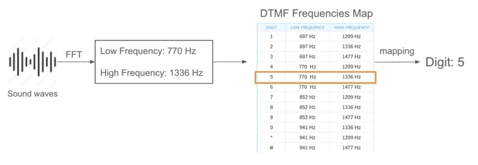


Now that we have the audio file of keys, we can extract time series representation of the tone. We first try to classify from time domain signals series. Here is the prompt:  
**Prompt for time-series DTMF decoding:**  
> You are an expert in signal processing and audio analysis, specializing in interpreting time-series waveforms. Your task is to extract a phone number from the given sequence of numerical values, which represents an audio waveform over time.  
> **Guidelines**  
> &nbsp;&nbsp; 1. The input is a **time-domain signal**, where key patterns may be present that correspond to specific events.  
> &nbsp;&nbsp; 2. The numbers in the sequence might contain **distinct segments** that represent different parts of the phone number.  
> &nbsp;&nbsp; 3. Consider common **patterns in telephone systems** that can help you determine the digits.  
> &nbsp;&nbsp; Now, analyze the following time-series waveform and extract the corresponding phone number. Please provide your answer in <<>> format: {audio_data_template}


However, LLMs refused to predict directly from time domain signals due to inability of converting time domain signals to frequency domain. For example, GPT-4o responsed as below:
> &nbsp;&nbsp; Extracting a phone number from a sequence of numerical values representing an audio waveform requires identifying distinct patterns that could correspond to specific digits. A specific series of tones, known as Dual-Tone Multi-Frequency (DTMF) signals, is commonly used in telecommunication systems to convey phone numbers. Each key on a standard telephone keypad is associated with a specific combination of two frequencies, which allows the system to recognize which digit has been pressed. In this scenario, the waveform likely corresponds to such DTMF signals, encoded in the numerical sequence. However, the analysis of such a waveform to accurately decode DTMF **requires transforming the data from the time domain into the frequency domain (e.g., using a Fourier Transform)** to detect these frequency pairs. Without conducting such an analysis directly within this interface, it's challenging to accurately extract a phone number from the numerical sequence provided.Therefore, assuming this waveform does encode a phone number through something akin to DTMF coding, **the solution involves:**  
> &nbsp;&nbsp;&nbsp;&nbsp; **1. Transforming the data using Fourier Transform to detect prominent frequencies within the waveform.**  
> &nbsp;&nbsp;&nbsp;&nbsp; **2. Identifying the combination of two frequencies that constitute a DTMF tone for each segment.**  
> &nbsp;&nbsp;&nbsp;&nbsp; **3. Mapping each frequency combination to its corresponding keypad number.**  
> &nbsp;&nbsp; This process would **require specialized software** to analyze the waveform, which currently **isn't possible in this text-based interface**. Consequently, here’s a placeholder regarding the extracted phone number format you would expect once such an analysis is performed: <<extracted_phone_number>>.If you'd like further assistance with actual data and interpretation via more interactive and computational means, I recommend using dedicated signal processing tools or software for frequency analysis.

From the given responses, the models seem to know the correct method of DTMF classification, but just blocked by the convertion between time- and frequency-domain. Therefore, we conduct the transformation for them. Specifically, we applied the Fourier Transform to convert the audio signals into frequency-domain representations, consisting of frequency-magnitude pairs, which were then used as input. We experimented two kinds of input representations: frequency series provided as raw text, and frequency series provided as plotted line graph. The experiments were conducted on 12 DTMF keys (0–9, *, #), with 20 samples per key. In each test, LLMs are required to decode a single key.

[^1]: Code is based on [dtmf-generator](https://github.com/cleversonahum/dtmf-generator.git)

### 3.2 Results
**Table 1: DTMF Key Decoding Accuracies (%)**
|                               | DeepSeek-R1 (text only) | GPT-4o | GPT-o1 |
| ----------------------------- | ----------------------- | ------ | ------ |
| Frequency Text (w/o guidance) | 95.0                    | 7.9    | 96.7   |
| Frequency Text (w/ guidance)  | -                       | 8.3    | 96.3   |
| Frequency Plot                | -                       | 25.8   | 36.2   |

**1) Frequency Series in Text**
First, we provide LLMs with raw frequency data in text. The input is a series of frequency-magnitude pairs in the format of *"frequency1: magnitude1, frequency2: magnitude2, ..."*. For example, the following series representing key "0" might look like: "12.5:3.30, 25.0:3.30, 37.5:3.30, ..., 912.5:64.33, 925.0:114.71, 937.5:525.26, 950.0:204.74, 962.5:85.96, 975.0:54.57, ...". To evaluate the models’ inherent reasoning capabilities, we first presented the data without any task-specific instructions or guidance. We then introduced prompts that provided step-by-step guidance to offer more contextual information and assist the models in the reasoning process. Here are the prompts:  

**Without Guidance:**  
```
You are an expertise in dual tone multi-frequency decoding. You are given a series of frequency components with corresponding amplitudes in the format of "frequency1:magnitude1, frequency2:magnitude2, ...". The frequency series represents a key (0-9, * or #). Please identify the key it refers to. Here is the frequency series:  {audio_data_template}
Please provide your answer in the following JSON structure:  
{
    "key": "the recognized key",  
    "analysis": "a detailed explanation of your analysis process."  
}
```

**With Guidance:**  
```
You are an expertise in dual tone multi-frequency decoding. You are given a series of frequency components with corresponding amplitudes in the format of "frequency1:magnitude1, frequency2:magnitude2, ...". The frequency series represents a key (0-9, * or #). **Please first recognize the frequencies with high magnitudes in this series.*Then, identify the key it refers to.** Here is the frequency series:  {audio_data_template}  
Please provide your answer in the following JSON structure:  
{
    "frequencies": [list of high-magnitude frequencies as floating-point numbers rounded to two decimal places],  
    "key": "the recognized key",  
    "analysis": "a detailed explanation of your analysis process."  
}
```

To ensure a fair comparison, models were not required to explicitly extract frequency peaks in the unguided setting, avoiding any direct or indirect hints about the classification steps.

Table 1 reveals a significant performance gap between GPT-4o and GPT-o1, DeepSeek-R1. While GPT-o1 and DeepSeek-R1 achieve over 95% accuracies, GPT-4o struggls with a much lower accuracy of 7.9%, similar to random guess. The confusion matrices ([Fig. 2(a)](#4o_conf_mat_w/o_guide)) doesn't show explicit pattern of consistent misclassification. Even after adding step-by-step prompts, which guide the model to identifying dominant frequency peaks before mapping them to DTMF keys, GPT-4o’s accuracy only marginally improved to 8.3%. This minimal gain indicates that GPT-4o was unable to leverage the added guidance effectively.

These findings also highlights the strong enhancement of reasoning during the LLMs training process, leading to a stronger ability to process and reason on structured numerical data. Models like DeepSeek-R1 and GPT-o1 show significantly stronger capabilities in processing and reasoning over structured numerical data, whereas GPT-4o apperas to fall short.

**Figure 2: Confusion matrices of GPT-4o inputing text-based frequency series:**  
|                                                                                                                                                                                                                |                                                                                                                                                                                                                  |
| :------------------------------------------------------------------------------------------------------------------------------------------------------------------------------------------------------------: | :--------------------------------------------------------------------------------------------------------------------------------------------------------------------------------------------------------------: |
| <a name="4o_conf_mat_w/o_guide"></a> 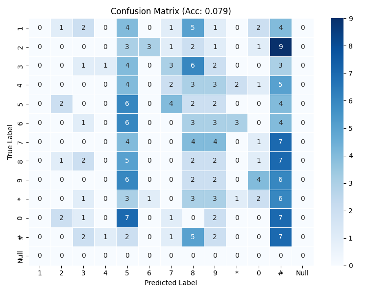 | <a name="4o_conf_mat_w/_guide"></a> 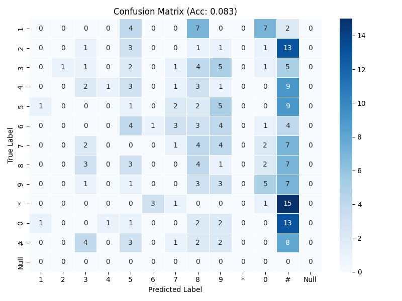 |
|                                                                                    (a) prompt without step-by-step guidance                                                                                    |                                                                                      (b) prompt with step-by-step guidance                                                                                       |

DTMF decoding can be roughly divided into two steps: 1) detect the low and high frequencies of the tone, 2) map the frequencies to a specific key using DTMF map. To further explore on which step did GPT-4o fail, we additionally analyze the accuracy of frequency detection and mapping from frequency pair to key. Specifically, we calculate 4 accuracies for each experiment:
1. Accuracy of recognized key comparing to the true key,
1. Accuracy of detected low frequency comparing to the true low frequency,
1. Accuracy of detected high frequency comparing to the true high frequency,
1. Accuracy of recognized key comparing to the detected frequency.

For example, a key is “8” (852Hz, 1336Hz). LLM detects the frequencies as (941Hz, 1336Hz), and recognized it as “0”. In this case, the results of each accuracies are as follow:
1. False (since “0” doesn’t match with “8”);
1. False (since the low frequency is wrong);
1. True (since the high frequency is correct);
1. True (since 941Hz, 1336Hz correctly maps to “0”).

Since the test data contains noise and the input frequency series is downsampled to intervals of 2.5 Hz, we allow a ±5 Hz tolerance when evaluating frequency detection accuracy (metrics 2 and 3). Invalid frequency detections are excluded when calculating the accuracy of mapping detected frequencies to recognized keys (metric 4).
We compare GPT-4o and GPT-o1 with guidance in prompt. Here are the results for the detailed step-by-step accuracies:

**Table 2: Step-by-step DTMF Key Decoding Accuracy (Frequency Text Series):**
|        | Overall Accuracy (Acc1) | Low Frequency Detection (Acc2) | High Frequency Detection (Acc3) | Frequency to Recognized Key (Acc4) |
| ------ | ----------------------- | ------------------------------ | ------------------------------- | ---------------------------------- |
| GPT-4o | 8.3                     | 95.8                           | 80.4                            | 10.4                               |
| GPT-o1 | 96.3                    | 100                            | 100                             | 96.3                               |

&nbsp;
&nbsp;
&nbsp;

**Figure 3: Confusion matrices of frequency to key prediction (the 4th accuracy) (text-based frequency series input):**
|                                                                                           |                                                                                           |
| :---------------------------------------------------------------------------------------: | :---------------------------------------------------------------------------------------: |
| 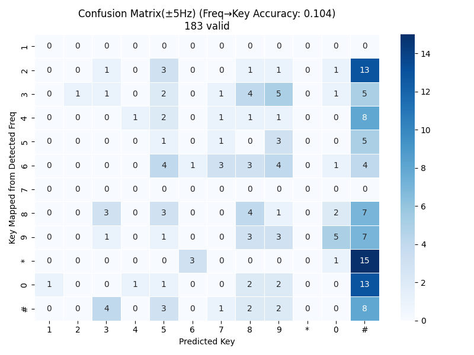 | 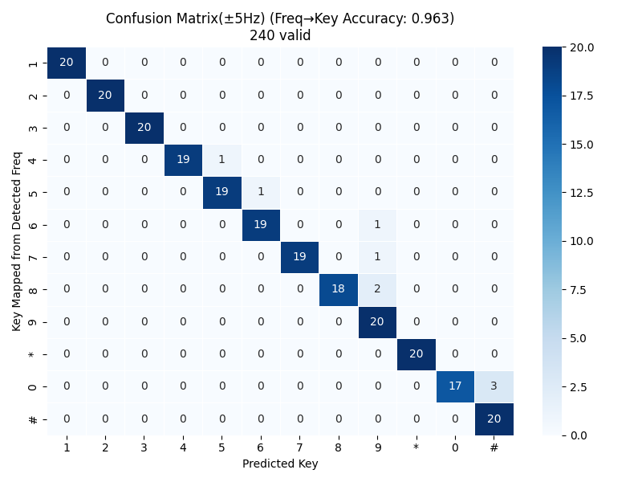 |
|                                        (a) GPT-4o                                         |                                        (b) GPT-o1                                         |


Both GPT-4o and GPT-o1 can tell the most significant frequencies accurately for text-based frequencies input, and GPT-o1 works extremely well to reach an 100% accuracy. The above confusion matrices show that GPT-4o had 183 out of 240 test samples valid frequencies, but misclassified nearly half of them as "#". On the other hand, GPT-o1 provided valid frequency detections for all data and mapped 96.3% of them accurately.  

The frequency error distribution plots further illustrate this difference: GPT-4o shows a higher mean and standard deviation in absolute frequency error compared to GPT-o1. While GPT-4o’s detection errors can reach up to 12 Hz, GPT-o1 consistently maintains errors within the ±5 Hz margin.

**Figure 4: Distributions of GPT-4o frequency detection errors**
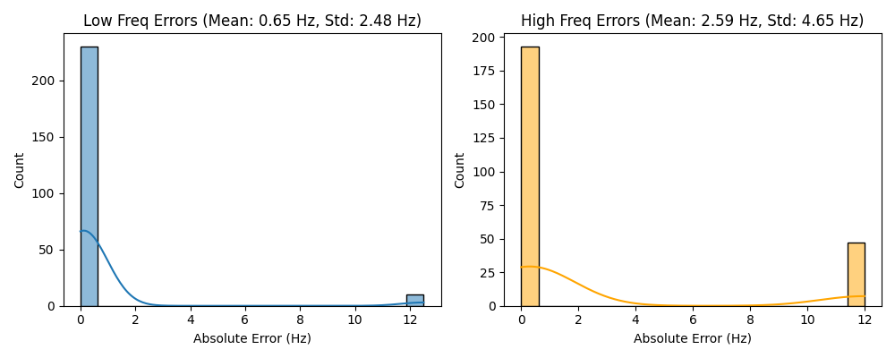

**Figure 5: Distributions of GPT-o1 frequency detection errors**
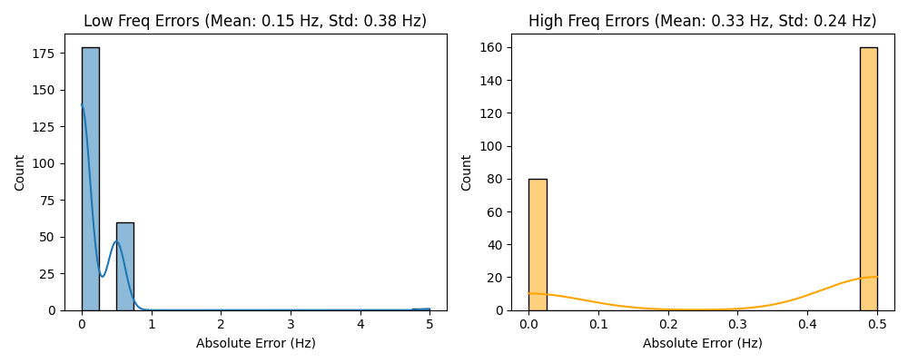

Although GPT-o1 clearly outperforms GPT-4o, the latter still demonstrates reasonably good frequency detection. The main gap lies in the second step: mapping detected frequencies to DTMF keys. While GPT-o1 achieves a 96.3% accuracy in this step, GPT-4o only correctly maps about 10% of keys, drasticly dragging down its overall performance. **Why GPT-4o cannot recognize key precisely, even given the frequency pairs?**

**Study of GPT-4o DTMF frequency mapping**  
Intuitively speaking, this step is easy - getting the DTMF map, and corresponding the frequency pairs to the key. GPT-4o may fail either because it lacks the correct DTMF map or is unable to apply it properly.

To investigate this, we conducted two experiments: one where GPT-4o was asked to infer the key without being provided the DTMF map, and another where the correct map was explicitly included in the prompt. The prompts for each experiment is shown below. 

- **Prompt without DTMF map:**
```
You are an expertise in dual tone multi-frequency decoding. You are given a frequency pair of a tone which represents a key (0-9, * or #). Please identify the key it refers to. Here is the frequency pair: {freq_pair}
Please provide your answer in the following JSON structure:  
{  
    "key": "the recognized key",  
    "analysis": "a detailed explanation of your analysis process."  
}  
```

- **Prompt with DTMF map:**  
```
You are an expertise in dual tone multi-frequency decoding. You are given a frequency pair of a tone. This tone represents a key (0-9, * or #). Here is the frequency pair: {freq_pair}.
Please identify the key it refers to using the map below.  
    | Low Frequency (Hz) | High Frequency (Hz) | Key |
    | ------------------ | ------------------- | --- |
    | 697                | 1209                | 1   |
    | 697                | 1336                | 2   |
    | 697                | 1477                | 3   |
    | 770                | 1209                | 4   |
    | 770                | 1336                | 5   |
    | 770                | 1477                | 6   |
    | 852                | 1209                | 7   |
    | 852                | 1336                | 8   |
    | 852                | 1477                | 9   |
    | 941                | 1209                | *   |
    | 941                | 1336                | 0   |
    | 941                | 1477                | #   |
Please provide your answer in the following JSON structure:  
{  
    "key": "the recognized key",  
    "analysis": "a detailed explanation of your analysis process."  
}  
```


The results show a clear distinction. Without map, GPT-4o only achieves an accuracy of 3.7%([confusion matrix without map](https://github.com/nesl/LLM_time_series/blob/master/results/dtmf/conf_matrix_gpt4o_noise_freq_pair_overall.png)), but once given the map, it jumped to 82.5%([confusion matrix with map](https://github.com/nesl/LLM_time_series/blob/master/results/dtmf/conf_matrix_gpt4o_noise_freq_pair_map_overall.png)), approaching GPT-o1. This suggests that although GPT-4o knows the overall procedure for DTMF decoding, as it stated in the very first response with time-domain input, it lacks the domain-specific knowledge (i.e., the correct DTMF map) or fails to leverage it properly. Given that GPT-4o responses the correct DTMF map for innegligible times in our experiments, it is more likely that the reasoning capability of GPT-4o is not enough for it to stabily apply domain knowledge without explicit instructions. Providing model with necessary domain-specific references can significantly improve performance.

Interestingly, GPT-4o performs even worse given the noised frequency pairs (3.7% accuracy) than it did in the previous frequency-to-key mapping step. The confusion matrix (Fig. 6) somehow explained this wierd observation: GPT-4o rejected 178 out of 240 samples, because "The provided frequency pair does not correspond to any valid DTMF key"[^2]. This implies that GPT-4o expected exact frequency matches and lacked the tolerance to accommodate small deviations introduced by noise. On the other hand, when provided frequency-magnitude series, the model denoised the input by itself during frequency detection, resulting in fewer invalid predictions. When the original (clean) DTMF frequency pairs were used (the right confusion matrix in Fig. 6), GPT-4o returned no invalid predictions, and the accuracy improved to 45.8%. This further confirms its sensitivity to noise and the lack of flexibility in frequency matching.

Overall, GPT-4o is subject to limitations of domain knowledge and poor robustness to minor turbulence. The two reasoning models GPT-o1 and DeepSeek-R1 completely surpass GPT-4o on these limitations, indicating the strong power of reinforcement learning.


**Figure 6: Confusion matrix of GPT-4o inputting frequency pairs:**
|                                                                         |                                                                        |
| :---------------------------------------------------------------------: | :--------------------------------------------------------------------: |
| 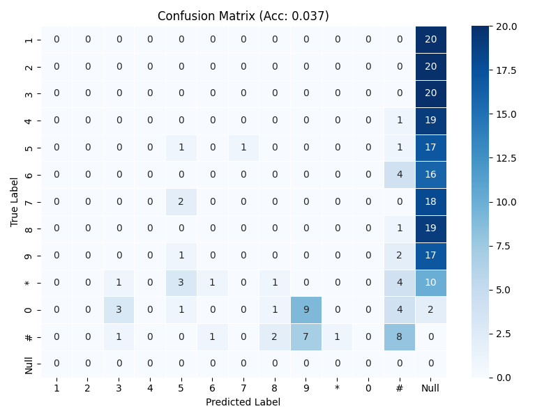 | 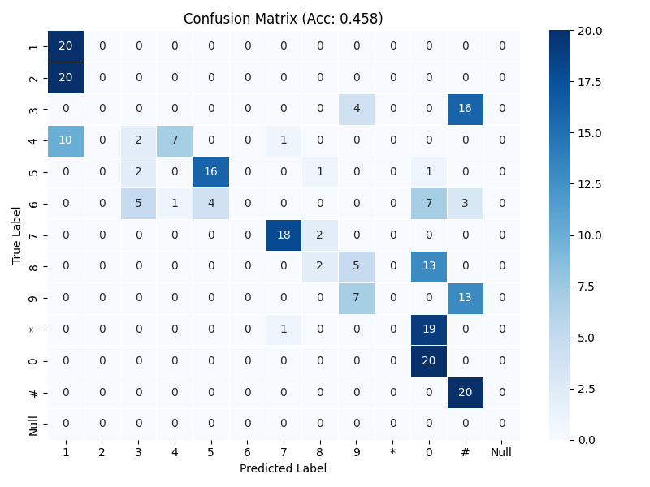 |
|                               (a) noised                                |                               (b) clean                                |

[^2]: Please refer to [results_gpt4o_noise_freq_pair.csv](https://github.com/nesl/LLM_time_series/blob/master/results/dtmf/results_gpt4o_noise_freq_pair.csv) for raw responses and analysis of GPT-4o given noised frequeny pair input.

**2) Frequency Series Plot**
The second experiment assessed the models' capability to recognize visual frequency plots. Similarily, the models are required to detect peaks in the plots first and then infer the corresponding key. The prompt is:
```
You are an expertise in dual tone multi-frequency decoding. Please first recognize the exact frequencies of peaks in this plot. Then, identify the key it refers to.
Please provide your answer in the following JSON structure:
{
    "frequencies": [list of peaks frequencies as floating-point numbers rounded to two decimal places],
    "key": "the recognized key",
    "analysis": "a detailed explanation of your analysis process."
}
```
One image of frequency series line graph is inputted together. Here is an example (this plot refers to key "0"):
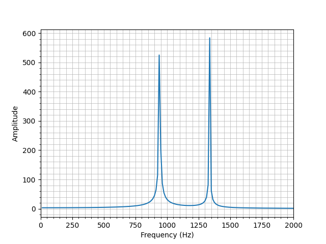

The result is shown in Table 1 above. From the confusion matrices (Fig. 7), we can see that both models exhibit a tendency to misclassify keys toward middle-range frequency values, particularly “5” for GPT-4o and “4”, “5”, or “6” for GPT-o1. This suggests that when uncertain, LLMs may default to “safer” middle-range predictions.

**Figure 7: Confusion matrix of GPT-4o and GPT-o1 inputting frequency series line graph:**  
|                                                                                    |                                                                                    |
| :--------------------------------------------------------------------------------: | :--------------------------------------------------------------------------------: |
| 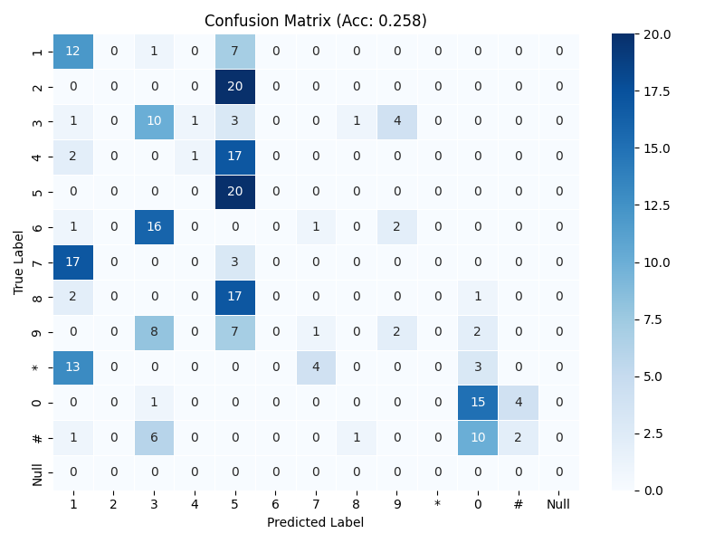 | 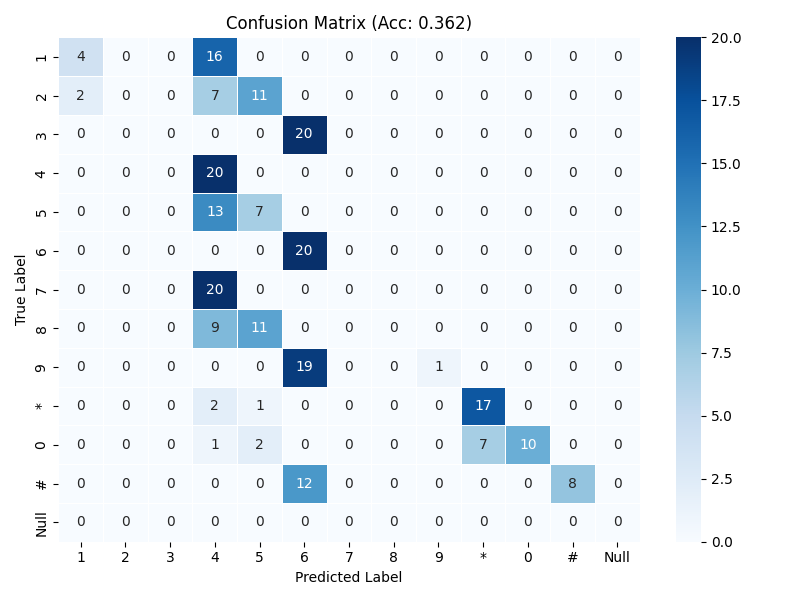 |
|                                     (a) GP-4o                                      |                                     (b) GPT-o1                                     |

Overall, GPT-o1 keeps outperforming GPT-4o. However, the effect of visual input representation varies between the models: it benefits GPT-4o (accuracy boosted from 8.3% to 25.8%), while hinders GPT-o1 comparing to text-based input (accuracy dropped from 96.3% to 36.2%).

Here are the step-by-step results of frequency plots. Since plots are inherently less precise than numerical inputs, we adopt a wider error tolerance of ±15 Hz for peak detection accuracy.  

**Table 3: Step-by-step DTMF Key Decoding Accuracy (Noised Frequency Plot):**  
|        | Overall Accuracy (Acc1) | Low Frequency Detection (Acc2) | High Frequency Detection (Acc3) | Frequency to Recognized Key (Acc4) |
| ------ | ----------------------- | ------------------------------ | ------------------------------- | ---------------------------------- |
| GPT-4o | 25.8                    | 47.1                           | 80.8                            | 51.5                               |
| GPT-o1 | 36.2                    | 44.6                           | 83.3                            | 96.3                               |

In the first step of frequency detection, both GPT-4o and GPT-o1 struggle with detecting the peaks of plots, especially the peak of low frequency, and the performance gap between two models are is also narrower here than in text-based setting. This suggests that current LLMs still face challenges in precise visual pattern recognition, especially when dealing with subtle variations. Text-based frequency data allows models to process exact numerical values directly, whereas visual representations introduce ambiguity due to pixel-based resolution limits and the inherent difficulty of image recognition.

In the second step of frequency-to-keys mapping, GPT-4o performed better with plots than with textual frequency series, but still far from good. However, this improvement may be misleading, as the result is heavily biased. As Fig. 8 shows, most detected frequency peaks from GPT-4o are assigned toward key "5", likely coming from the model’s tendency to default to mid-range predictions under uncertainty as analysed before, which inflates the mapping accuracy for those specific cases.

**Figure 8: Confusion matrix of frequency to key prediction of GPT-4o (frequency series plot input):** 
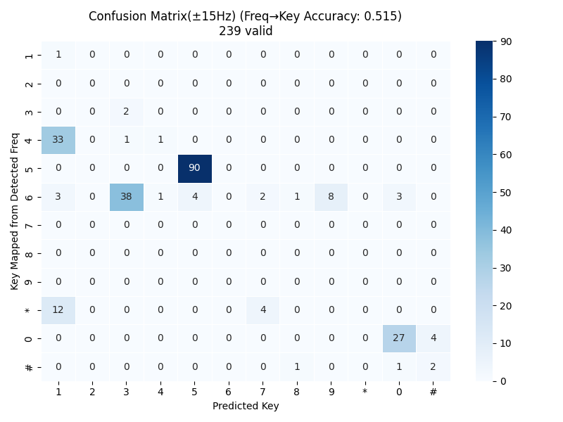


Table 3 also provides an interesting investigations: the models are worse at detecting low frequency values comparing to high frequency. We did some breakdown experiments to further explore it.

**Why the models are worse on low frequency?**  
The first possible explanation is that for the classification of 12 DTMF keys, low frequency has one more class than high frequency, naturally making it more complicated. Secondly, the gaps between low frequencies (697Hz, 770Hz, 852Hz, 941Hz) are smaller than those of high frequencies (1209Hz, 1336Hz, 1477Hz), reducing the fault tolerance. Moreover, since we add noise when generating audio files, these smaller gaps in the low-frequency range may amplify the effect of noise.

The first two hypotheses are not straightforward to verify directly. To isolate and quantify the impact of noise, we test the models on DTMF tones generated without noise. The experiment settings are identical with those used with noisy frequency line plots, except that the input plots were generated from clean signals without added noise.

**Table 4: Step-by-step DTMF Key Decoding Accuracy (Clean Frequency Plot):**  
|        | Overall Accuracy (Acc1) | Low Frequency Detection (Acc2) | High Frequency Detection (Acc3) | Frequency to Recognized Key (Acc4) |
| ------ | ----------------------- | ------------------------------ | ------------------------------- | ---------------------------------- |
| GPT-4o | 25.4                    | 48.7                           | 80.0                            | 50.6                               |
| GPT-o1 | 35.8                    | 42.9                           | 83.3                            | 99.6                               |

There is no significant differences between Table 3 (noised frequency plot input) and Table 4 (clean frequency plot input), suggesting that the performance difference is primarily due to the discrepancies in class number and frequency intervals, rather than noise.

### 3.3 Conclusion of DTMF
Through DTMF decoding, our findings highlight several limitations and strengths of current large language models (LLMs). While GPT-4o is powerful in many areas, it lacks the capability to transform time-domain data into the frequency domain, underscoring a gap in its external tool calling. For frequency domain inputs, reasoning models such as DeepSeek-R1 and GPT-o1 demonstrate significantly stronger abilities in processing structured numerical data, showing the great enhancement of such technique to LLMs logical reasoning skills. Furthermore, our results show that augmenting LLMs with domain-specific knowledge can improve their performance on targeted tasks. This may be a promising direction for future model development. Nevertheless, challenges remains: current LLMs still struggle with visual input processing, especially precise recognition (e.g, identify the exact line graph peak).

## 4. Human Activity Recognition (HAR) Experiments and Analysis
### 4.1 Methods
We select the same LLMs as used in DTMF (DeepSeek-R1, GPT-4o, GPT-o1) to mark the capability of LLMs in recognizing human activities. Inspired by recent studies of LLMs for HAR, we primarily assess the impact of input representation and prompt engineering on model performance. This project covers three widely-used prompt engineering methods: zero-shot prompting [[23]](#23), few-shot prompting [[2]](#2) and Chain-of-Thought [[28]](#28) [[11]](#11). For input representations, this project targets at raw numerical text [[32]](#32) [[9]](#9), natural language descriptions [[22]](#22) [[16]](#16), visual plots [[30]](#30) [[31]](#31) [[34]](#34), and multimodal inputs. Here is the complete list of input formulars tested in this project:
1. IMU time series as raw text (zero-shot prompting),
2. IMU time series text with one-shot learning,
3. IMU time series with trend description,
4. IMU time series as visual plots,
5. IMU time series plot with one-shot learning,
6. multimodal inputs (IMU time series plot and the environment photo),
7. environment photo only.

We use prompt from HARGPT [[4]](#4) which also focusing on HAR, and tailored input description for different input settings.

**1. IMU time series as raw text:**  
All the sensor data are integrated in prompts in their original formats. Here is the prompt:
```
**Prompt for IMU time series as raw text (for GPT models):**
You are an expert of IMU-based human activity analysis. The IMU data is collected from {device_name} attached to the user's {location} with a sampling rate of {freq}Hz. The IMU data is given in the IMU coordinate frame. The three-axis accelerations, gyroscopes and magnetometers are given below.
    Accelerations:
    x-axis: {...}, y-axis: {...}, z-axis: {...}
    Gyroscopes:
    x-axis: {...}, y-axis: {...}, z-axis: {...}
    Magnetometer:
    x-axis: {...}, y-axis: {...}, z-axis: {...}

The person's action belongs to one of the following categories: Still, Walking, Run, Car.

Could you please tell me what action the person was doing based on the given information and IMU readings? Please make an analysis step by step. Please provide your answer in the following JSON structure:
{
    "label": the predicted human action category,
    "analysis": a detailed explanation of your analysis process
}
```

The above output structure is used for GPT-4o and GPT-o1. Since DeepSeek-R1 API doesn't support JSON object output format, we use the following output format prompt instead:
```
**Output format prompt for DeepSeek-R1:**
Please provide your answer in the format of <<ACTION>> at the first word of your response, followed by your detailed analysis.
```

All HAR experiments use these structures for respective models. In the following prompts illustrations, we only take GPT-style output structure as examples.

**2. IMU time series text with one-shot learning:**  
One example IMU data of each class (different with testing data) is provided in addition. Here is the prompt:
```
You are an expert of IMU-based human activity analysis. The IMU data is collected from {device_name} attached to the user's {location} with a sampling rate of {freq}Hz. The person's action belongs to one of the following categories: Still, Walking, Run, Car. Here are examples for each class:
    Still:
        Accelerations:
        x-axis: {...}, y-axis: {...}, z-axis: {...}
        Gyroscopes:
        x-axis: {...}, y-axis: {…}, z-axis: {...}
        Magnetometer:
        x-axis: {...}, y-axis: {...}, z-axis: {...}
    Walking: ...
    Run: ...
    Car: ...

The IMU data is given in the IMU coordinate frame. The three-axis accelerations, gyroscopes and magnetometers are given below.
    Accelerations:
    x-axis: {...}, y-axis: {...}, z-axis: {...}
    Gyroscopes:
    x-axis: {...}, y-axis: {...}, z-axis: {...}
    Magnetometer:
    x-axis: {...}, y-axis: {...}, z-axis: {...}
Could you please tell me what action the person was doing based on the given information and IMU readings? Please make an analysis step by step. Please provide your answer in the following JSON structure:
{
    "label": the predicted human action category,
    "analysis": a detailed explanation of your analysis process
}
```

**3. IMU time series with trend description:**  
Comparing to raw sensor data, LLMs are better at understanding natural language. This approach includes two callings of LLMs. First, use LLMs to summarize the features of raw sensor data, including tendencies, distributions, statistical features like mean, variance. Second, provide both the description and original IMU data for recognition. The first prompt refers to LLMSense [[5]](#5), and the second prompt comes from HARGPT [[4]](#4).

```
**Step 1: Prompt for description:**
You are an expert of IMU-based human activity analysis. The IMU data is collected from {device_name} attached to the user's {location} with a sampling rate of {freq}Hz. The IMU data is given in the IMU coordinate frame. The three-axis accelerations, gyroscopes and magnetometers are given below.
    Accelerations:
    x-axis: {...}, y-axis: {...}, z-axis: {...}
    Gyroscopes:
    x-axis: {...}, y-axis: {…}, z-axis: {...}
    Magnetometer:
    x-axis: {...}, y-axis: {...}, z-axis: {...}
Please analyse the sensor data trend variations, and provide a summary of sensor data's main elements and their trend distributions.
```

```
**Step 2: Prompt for recognition:**
You are an expert of IMU-based human activity analysis. The IMU data is collected from {device_name} attached to the user's {location} with a sampling rate of {freq}Hz. The IMU data is given in the IMU coordinate frame. 
The person's action belongs to one of the following categories: Still, Walking, Run, Car.

Here is a detailed description of the IMU signals: {imu_description_from_step1}.

The three-axis accelerations, gyroscopes and magnetometers are given below.
    Accelerations:
    x-axis: {...}, y-axis: {...}, z-axis: {...}
    Gyroscopes:
    x-axis: {...}, y-axis: {…}, z-axis: {...}
    Magnetometer:
    x-axis: {...}, y-axis: {...}, z-axis: {...}

Could you please tell me what action the person was doing based on the given information, IMU description and IMU readings? Please make an analysis step by step. Please provide your answer in the following JSON structure:
{
    "label": the predicted human action category,
    "analysis": a detailed explanation of your analysis process
}
```

**4. IMU time series as visual plots:**  
Instead of providing textual information, we plot the IMU time-series into line graph as input to test whether multimodal LLMs can understand patterns in representations other than text.
```
You are an expert of IMU-based human activity analysis. The IMU data is collected from {device_name} attached to the user's {location} for {DURATION} seconds with a sampling rate of {freq}Hz. The three-axis accelerations, gyroscopes and magnetometers are plotted in the given picture.

The person's action belongs to one of the following categories: Still, Walking, Run, Car.

Could you please tell me what action the person was doing based on the given information and IMU readings? Please make an analysis step by step. Please provide your answer in the following JSON structure:
{
    "label": the predicted human action category,
    "analysis": a detailed explanation of your analysis process
}
```

**Example of Input Image: (this image is labeled "Walking")**  
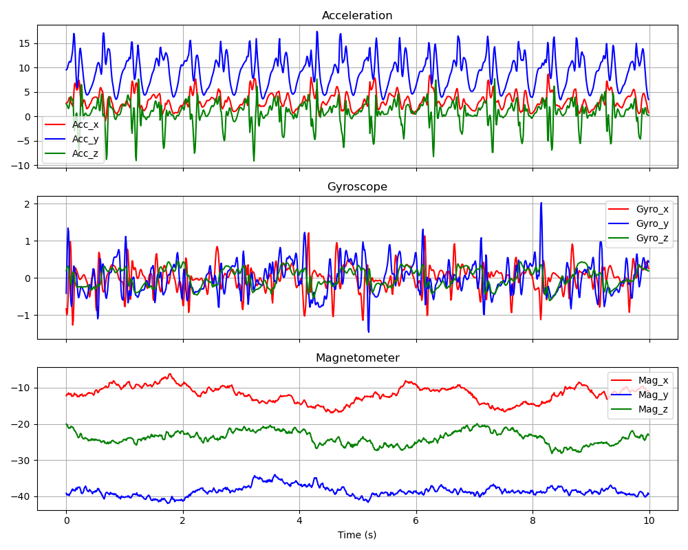

**5. IMU time series plot with one-shot learning:**
```
You are an expert of IMU-based human activity analysis. The IMU data is collected from {device_name} attached to the user's {location} for {DURATION} seconds with a sampling rate of {freq}Hz. The three-axis accelerations, gyroscopes and magnetometers are plotted in the given plot.

The person's action belongs to one of the following categories: Still, Walking, Run, Car. The first four plots are examples of IMU data readings for Still, Walking, Run and Car respectively.

Could you please tell me what action the person was doing based on the last plot? Please make an analysis step by step. Please provide your answer in the following JSON structure: 
{
    "label": the predicted human action category,
    "analysis": a detailed explanation of your analysis process
}
```

5 images will be included in each input. The first 4 plots are examples for Still, Walking, Run and Car respectively. LLMs need to recognize the action of the last image.  
**Input Image 1 (Example of "Still"):**  
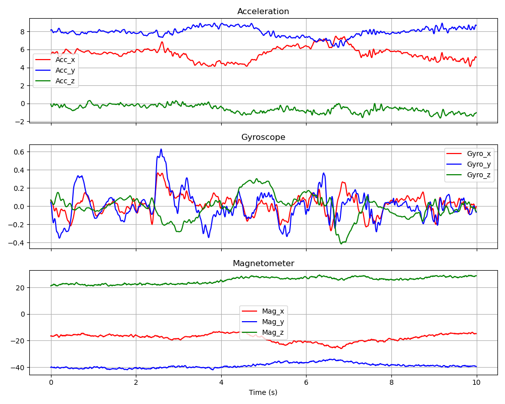

**Input Image 2 (Example of "Walking"):**  
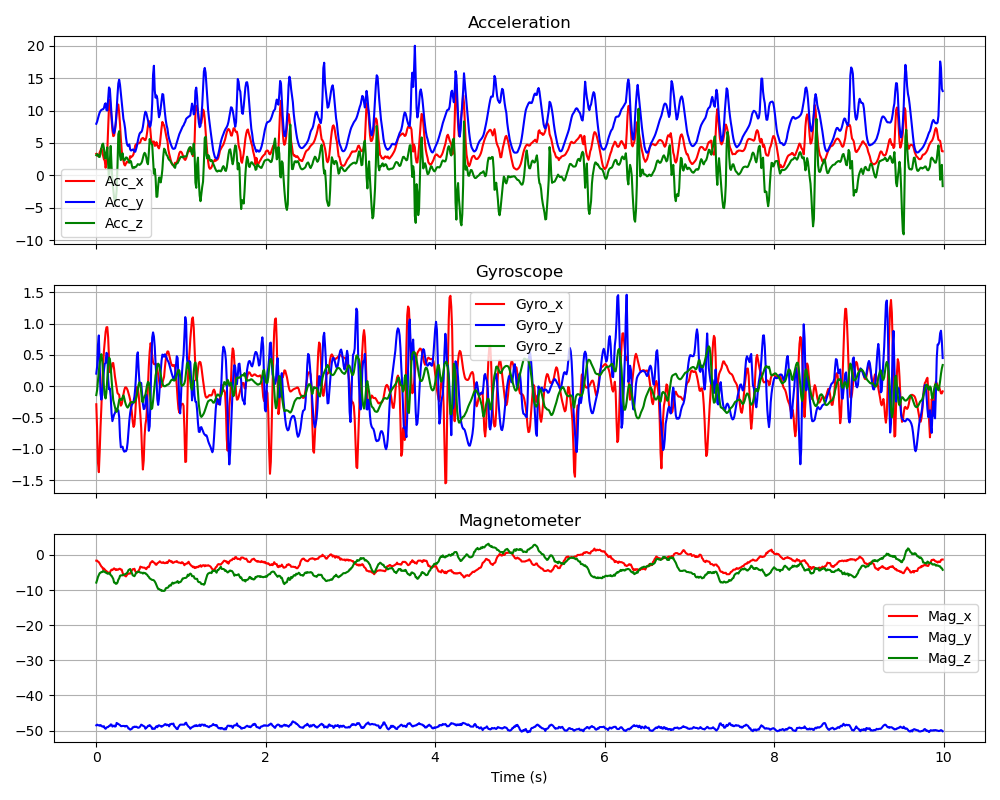

**Input Image 3 (Example of "Run"):**  
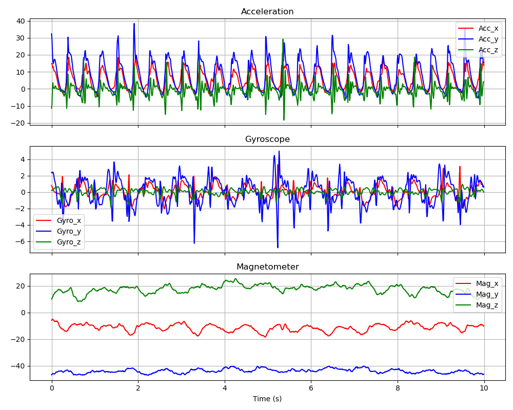

**Input Image 4 (Example of "Car"):**  
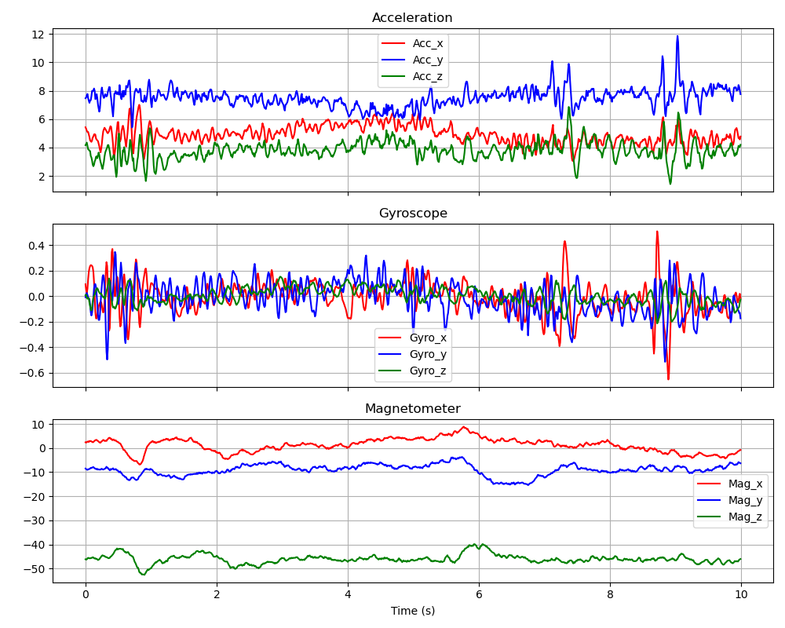

**Input Image 5: Test data (this image is labeled "Car"):**  
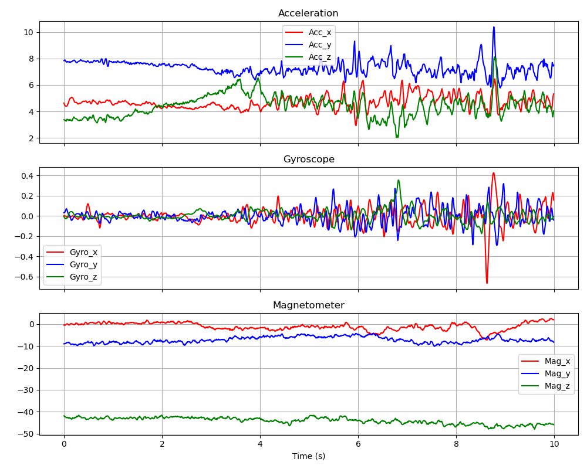

**6. Multimodal inputs:**  
In addition to IMU representations, an environmental photo taken during their transportation from a body-worn camera carried by the users is provided. This photo adds more visual and physical-world clues.
```
You are an expert of IMU-based human activity analysis. The IMU data is collected from {device_name} attached to the user's {location} for {DURATION} seconds with a sampling rate of {freq}Hz. You are given 2 images: the first image is the plot of three-axis accelerations, gyroscopes and magnetometers; the second image is an environment photo taken during this activity by a camera placed in the user's torso.

The person's action belongs to one of the following categories: Still, Walking, Run, Car.

Could you please tell me what action the person was doing based on the given information, IMU readings and environment photo? Please make an analysis step by step. Please provide your answer in the following JSON structure: 
{
    "label": the predicted human action category,
    "analysis": a detailed explanation of your analysis process
}
```

The input includes 2 images. The first image is IMU plot identical with the previous experiments, and the second image is the environment photos. The following provided plots refers to “Walking”.

**Input image 1:**  


**Input image 2:**  


**7. Environment photo**
We ask the LLMs to classify solely based on environment photo to study the effect of IMU plots and environment photo individually. 
```
You are an expert in human activity analysis. You are given an envorinment photo taken during a person's transportation by a camera placed in their torso.

The person's transportation method belongs to one of the following categories: Still, Walking, Run, Car.

Could you please tell me what transportation method the person was using based on the given information and the environment photo? Please make an analysis step by step.

Please provide your answer in the following JSON structure:
{
    "label": the predicted human action category,
    "analysis": a detailed explanation of your analysis process
}
"""
```
The input only include one image of the environment photo (Input image 2 in the prior experiment).

**Dataset** &nbsp; &nbsp; We conducted a series of experiments with different input representations on Sussex-Huawei Locomotion (SHL) dataset. It is a collection of smartphone sensor data for human activity and transportation  mode recognition. It encompasses eight distinct activities: Still, Walk, Run, Bike, Car, Bus, Train, and Subway. 3 participants carried Huawei Mate 9 smartphones at four body positions — Hand, Hips, Torso, and Bag — simultaneously, capturing data from 15 sensor modalities, including IMU (accelerometers, gyroscopes, magnetometers), GPS, WiFi, gravity, photo and more. This dataset contains around 750 hours of labeled data in total. 

To evaluate the basic ability of LLMs in processing time series signals, we simplify this task to only classify four typical motions: Still, Walking, Run, and Car from inertial measurement unit (IMU) data collected at a sampling rate of 100Hz, with each input sample spanning 10 seconds. We test on 30 samples for each class.

### 4.2 Results
**Table 5: SHL Human Activities Recognition Accuracies (%):**  
|                                          | DeepSeek-R1 (text only) | GPT-4o | GPT-o1 |
| ---------------------------------------- | ----------------------- | ------ | ------ |
| IMU time series text                     | 22.7                    | 28.6   | 34.5   |
| IMU time series text + one shot          | 72.5                    | 68.9   | 80.7   |
| IMU time series text + description       | 31.1                    | 33.6   | 42.9   |
| IMU time series plot                     | -                       | 30.0   | 46.7   |
| IMU time series plot + one shot          | -                       | 76.7   | 78.3   |
| IMU time series plot + environment photo | -                       | 70.8   | 83.3   |
| environment photo                        | -                       | 52.5   | 60.8   |

GPT-o1 generally outperforms GPT-4o and DeepSeek-R1, with all models exhibiting similar performance trends across different input representations. This reveals a clear dependence of LLM classification accuracy on input representation. Directly feeding numerical IMU readings as text results in poor performance. When presented with raw IMU text only, GPT-o1 performs the best among all three models, but just achieves 34.5%. DeepSeek-R1 and GPT-4o perform close to random classification, with accuracies of 22.7% and 28.6%, respectively.

Despite their similar overall accuracies, a closer look at the confusion matrices (Fig. 9) reveals differing prediction patterns. GPT-4o and GPT-o1 show a strong bias toward predicting “Walking” across all cases, followed by "Run". Similar to DTMF, "Walking" and "Run" can be considered as in the “middle” of four assigned classes, which may be favored by LLMs under uncertainty. In contrast, results of DeepSeek-R1 distributes more evenly but tends to mess up "Still" with "Car", and "Walking" with both "Car" and "Run".

Besides, 14 out of 120 outputs of DeepSeek-R1 cannot be successfully processed, because DeepSeek-R1 fails to follow our output structure requirement, resulting in the "Null" column in the confusion matrix below. This problem is likely due to the output format. DeepSeek-R1 API doesn't support JSON output, thus we prompt it to give the action in the format of `<<ACTION>>` as the first word of its responses. This looser constraint likely contributes to the formatting errors. On the other hand, GPT-4o and GPT-o1 consistently follow the JSON output format, as specified in the prompt, and do not suffer from this issue.

Adding a textual summary of motion patterns and trend description provides only marginal improvement. Summarization alone is insufficient to enhance model understanding and classification performance without richer context provided.

**Figure 9: Confusion matrices of raw text IMU time series input:**  
|                                                                                                                        |                                                                                                                        |                                                                                                                        |
| :--------------------------------------------------------------------------------------------------------------------: | :--------------------------------------------------------------------------------------------------------------------: | :--------------------------------------------------------------------------------------------------------------------: |
| <a name="dsr1_text_confmat"></a> 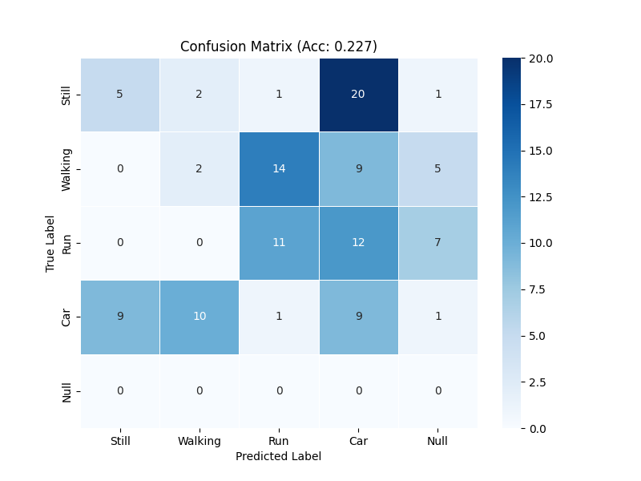 | <a name="gpt4o_text_confmat"></a> 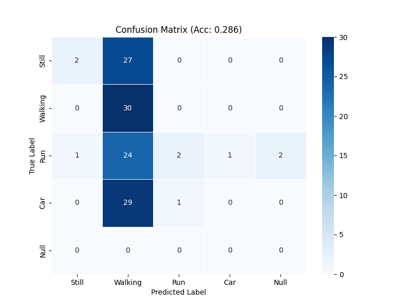 | <a name="gpto1_text_confmat"></a> 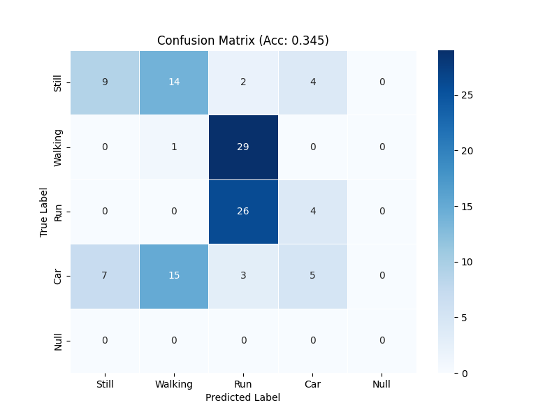 |
|                                                    (a) DeepSeek-R1                                                     |                                                       (b) GPT-4o                                                       |                                                       (c) GPT-o1                                                       |


When the IMU data is converted into time-series plots, GPT-4o yields an accuracy of 30.0%, slightly improved from raw text input. The benefit is more significantly on GPT-o1 with the accuracy jumping from 34.5% to 46.7%. This may indicate that data visualization makes LLMs extract and analyze time-series data characters more easily. However, such benefit is not salient enough, and the models still struggles with recognizing patterns independently. Similar to text only input, both models are prone to "Walking".

**Figure 10: Confusion matrices of IMU time series plots input:**  
|                                                                                       |                                                                                       |
| :-----------------------------------------------------------------------------------: | :-----------------------------------------------------------------------------------: |
| 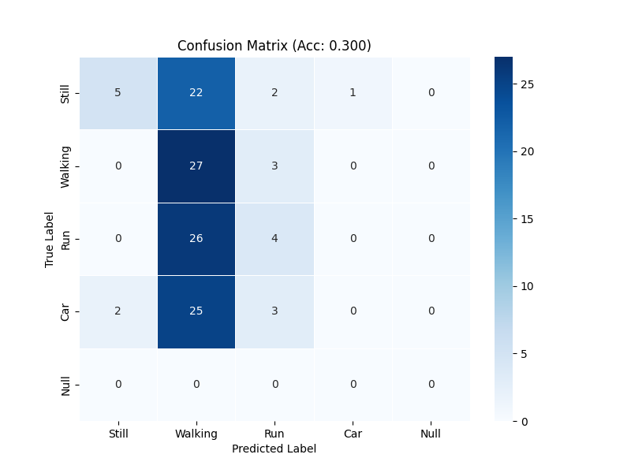 | 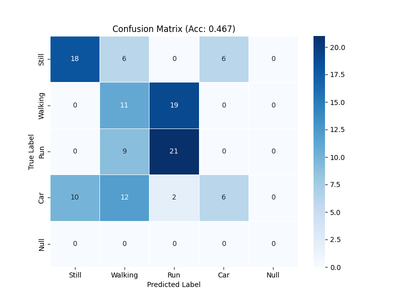 |
|                                      (a) GPT-4o                                       |                                      (b) GPT-o1                                       |

One-shot learning significantly boosts performance, demonstrating the strong generalization ability of LLMs from limited examples. All models have an accuracy boost for 30%~50% with a labeled IMU time-series example for each activity provided. The issue of prone to specific labels is alliviated, reflecting a noticeable improvement in recognizing distinct motion patterns. The same trend holds for visual input formats, which reinforces the idea that LLMs are good at patterns learning and matching with labeled context.

However, "Car" and "Still" remain hard for LLMs even with examples provided. As illustrated in the prompt section above, these two classes are indeed less distinctive than others, though they are not indistinguishable. “Walking” and "Run" have clear characters. Walking produces periodic vibrations in the accelerometer and gyroscope data. Running also shows periodic patterns but with sharper peaks and more frequent, intense fluctuations. “Car” and “Still” looks more similar to each other. Both generate relatively steady readings across accelerometers and gyroscopes. However, if looked closer, the accelerometer accelerometer is a slightly higher when the user is in a car, and the readings tend to be more turbulent. These subtle yet meaningful differences are often overlooked by LLMs, suggesting that they may still struggle to extract and reason over fine-grained, modality-specific cues. There remains significant room for improvement in enhancing LLMs' capability to perform nuanced cross-modal comparisons.

**Figure 11: Confusion matrices of IMU time series plots input with oneshot learning:**  
|                                                                                               |                                                                                               |
| :-------------------------------------------------------------------------------------------: | :-------------------------------------------------------------------------------------------: |
| 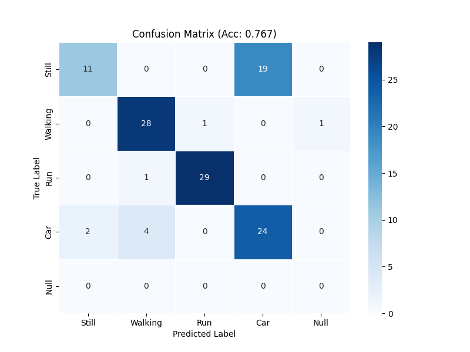 | 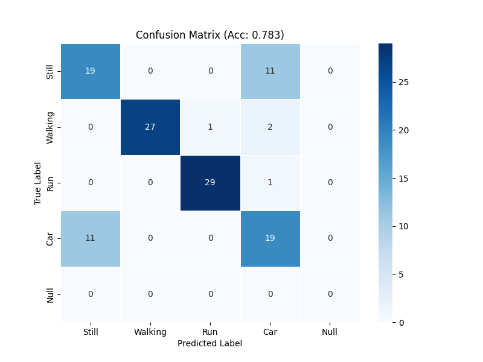 |
|                                          (a) GPT-4o                                           |                                          (b) GPT-o1                                           |

Inputting environment photo only performs better than inputting IMU time-series plots only. These photos allow the models to infer enviromental contextual information about the activity. For example, a photo of street scene likely belongs to “Walking” or “Run”, whereas a car windshield indicates vehicular movement. This also aligns with how we humans naturally infer transportation modes by combining motion cues with environmental context. Moreover, since these photos come from physical world, they are likely more prevalent than IMU plots in the models’ pretraining data, making them easier for LLMs to interpret.

The following confusion matrices indicate that LLMs recall almost all "Car" samples because of some explicit signals such as windshield, ahead viecle and road. Nevertheless, environment photo has its own limitations. It provide very limited information to tell street-view motions (Still, Walking and Run) apart from each other. Interestingly, GPT-4o ofter mistakes "Running" as "Car", since it overestimates the moving speed from the "blurry" photos taken when participants are running. Pure environmental photos lack direct information about the motion itself.

**Figure 12: Confusion matrices of pure environmental photos input:**  
|                                                                                      |                                                                                      |
| :----------------------------------------------------------------------------------: | :----------------------------------------------------------------------------------: |
| 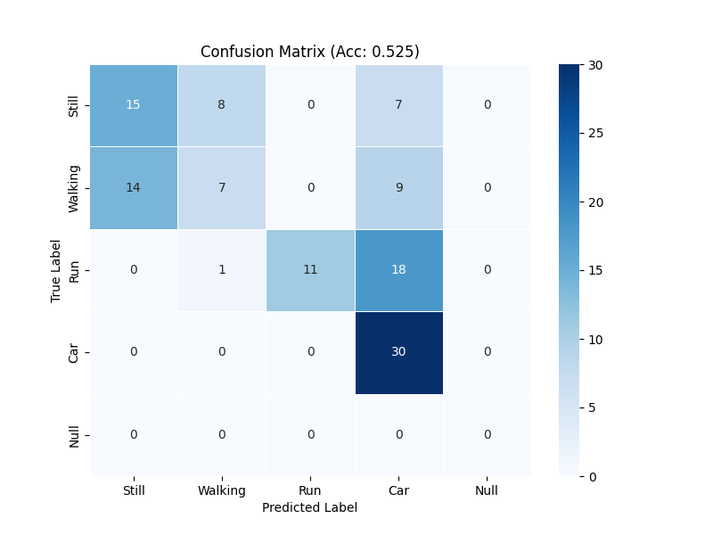 | 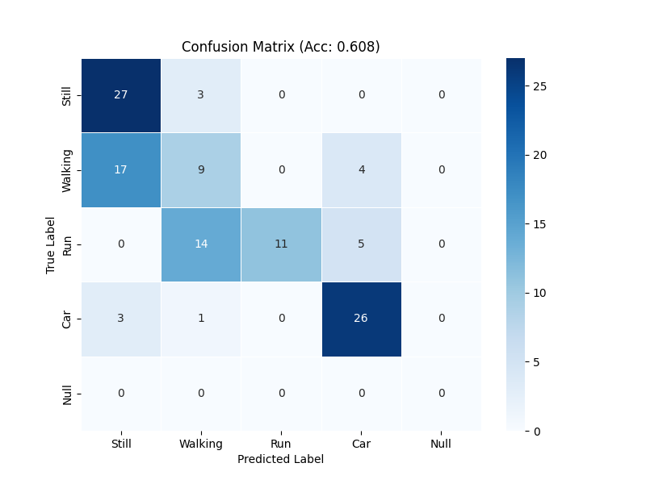 |
|                                      (a) GPT-4o                                      |                                      (b) GPT-o1                                      |

Incorporating multimodal cues will significantly enhance classification accuracy. When both IMU time-series plots and environment photos are provided, GPT-4o achieves 70.8% accuracy and GPT-o1 achieves 83.3%. IMU data and environment photo right complement each other: IMU data provides physical characters of motions that can differenciate "Walking"/"Run" and "Still"/"Car", and visual clues from photos separate street-view motions (Still, Walking) and inside motions (Car).

However, Fig. 13 shows that both models struggle to differentiate between “Walking” and “Run”, while GPT-4o continues to confuse “Still” with “Car.” The former confusion is likely because environmental photos do not provide enough visual distinction between walking and running scenes. The latter one is consistent with the results from the one-shot IMU plot experiment, most likely due to the similarity of their IMU signal patterns.

**Figure 13: Confusion matrices of IMU time series plots input with environmental photos:**  
|                                                                                             |                                                                                             |
| :-----------------------------------------------------------------------------------------: | :-----------------------------------------------------------------------------------------: |
| 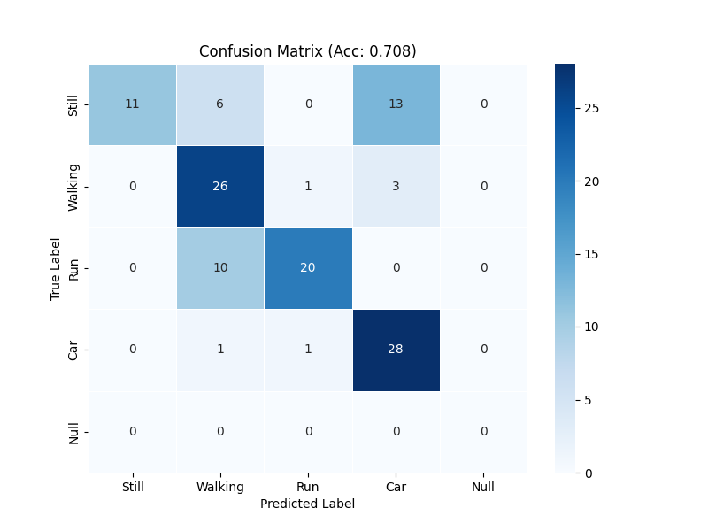 | 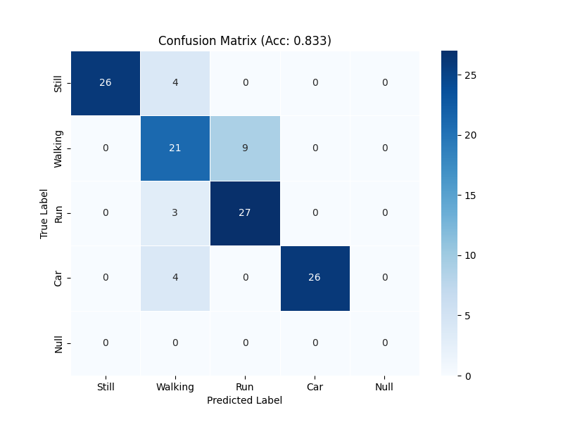 |
|                                         (a) GPT-4o                                          |                                         (b) GPT-o1                                          |

### 4.3 Conclusion of HAR
The HAR experiments reveal that input formation plays a crucial role in LLM-based IMU sensor data recognition. While raw IMU text leads to poor accuracy, combining it with semantic information, one-shot learning, visualization or multimodal integration brings improvements to different extents. Among all these enhancements, one-shot examples significantly boost performance across all models, further emphasizing LLMs’ strong generalization capabilities with minimal domain specific examples. Visualizing positively assists LLMs to identify IMU data characters for recognition. This is in contrast to our findings in DTMF experiments, suggesting that visual language models are better at recognizing general patterns, while limiting on detecting nuance. Similar to DTMF, GPT-o1 continues to achieve the highest accuracy among all evaluated models. Nonetheless, all models still struggle with distinguishing subtle classes, especially between “Still” and “Car” or “Walking” and “Run”, revealing LLMs' shortage in extracting fine-grained temporal and cross-modal patterns. These findings highlight the strengths and current boundaries of applying LLMs to HAR tasks, indicating that while there are some strategies to enhance performance, we still need more targeted modeling to address nuanced activity recognition.

## 5. Conclusion
This study investigates the use of Large Language Models (LLMs) for time-series classification through two diverse tasks: DTMF signal decoding and Human Activity Recognition (HAR). We systematically evaluate how different representations of time-series data—including raw numerical text, descriptive summaries, plots, and multimodal combinations—affect model performance.

Our results highlight several key insights:

- Input representation critically shapes LLM performance. Raw numerical inputs yield poor results. Contextual representations can boost the accuracy. Another more efficient improvement approach is one-shot learning, which reinforce the strong abilities of LLMs to generalize from few labeled and well-structured examples.
- GPT-o1 consistently outperforms GPT-4o and DeepSeek-R1 across tasks, demonstrating stronger reasoning, robustness, and domain adaptability. DeepSeek-R1 lags slightly behind but shows promise in certain reasoning tasks. GPT-4o is least competitive in time-series analysis among these three models, though the gap can be made up by domain knowledge enhancement techniques to some extent. This suggest that while LLMs hold promise for general time-series analysis, they currently heavily rely on prompt design, input representation, and prior domain knowledge.
- Visual inputs provide modest gains for some models but reveal substantial limitations in LLMs' visual interpretation abilities, particularly in some precise requirements, such as accurately identifying line peaks.
- Adding environment photos for HAR tasks enhances classification accuracy, underscoring the value of multimodal context.

It is worth noting that for both DTMF and HAR tasks, traditional methods still outperform LLMs in terms of classification accuracy and computational efficiency. However, the goal of this project is not to outperform existing methods, but rather to explore whether LLMs have the capability to handle time-series data in a general and flexible way. LLMs deliver competitive performance without any task-specific fine-tuning, demonstrating the promising potential of LLMs as general processor in time-series analysis.

Despite their potential, current LLMs still struggle with precise signal interpretation, domain-specific reasoning, and visual pattern recognition. Future research can explore methods for integrating domain-specific knowledge into LLMs more effectively, such as fine-tuning, retrieval-augmented generation, or embedding external knowledge bases. Additionally, improving models’ robustness to noise and enhancing their ability to process subtle signal features will be critical. The SHL dataset used for HAR was released before the LLMs in this study were trained, so the models might already seen part of it during training. It is worth to reevaluate on fully unseen datasets to verify these findings.

This project is only a prelimilary exploration of LLMs for time-series tasks, but it still provides some interesting insights. Expanding benchmarks to include a border range of time-series tasks (e.g., forecasting, anomaly detection) and evaluating models on cross-domain generalization could further deepen our understanding of LLMs’ potential in time-series analysis.[^3]


[^3]: ChatGPT is used to polish language in this report. All experimental results and analysis are original.

## References
<a id="1">[1]</a> Tuo An, Yunjiao Zhou, Han Zou, and Jianfei Yang. 2024. Iot-llm: Enhancing real-world IoT task reasoning with large language models. *arXiv preprint arXiv:2410.02429 (2024).*  
<a id="2">[2]</a> Tom Brown, Benjamin Mann, Nick Ryder, Melanie Subbiah, Jared D Kaplan, Prafulla Dhariwal, Arvind Neelakantan, Pranav Shyam, Girish Sastry, Amanda Askell, et al. 2020. Language models are few-shot learners. *Advances in Neural Information Processing Systems 33 (2020), 1877–1901.*  
<a id="3">[3]</a> Defu Cao, Furong Jia, Sercan O Arik, Tomas Pfister, Yixiang Zheng, Wen Ye, and Yan Liu. 2023. Tempo: Prompt-based generative pre-trained transformer for time series forecasting. *arXiv preprint arXiv:2310.04948 (2023).*  
<a id="4">[4]</a> Ching Chang, Wen-Chih Peng, and Tien-Fu Chen. 2023. LLM4TS: Two-stage fine-tuning for time-series forecasting with pre-trained LLMs. *CoRR (2023).*  
<a id="5">[5]</a> Jou-Fan Chen, Wei-Lun Chen, Chun-Ping Huang, Szu-Hao Huang, and An-Pin Chen. 2016. Financial time-series data analysis using deep convolutional neural networks. *In 2016 7th International Conference on Cloud Computing and Big Data (CCBD). IEEE, 87–92.*  
<a id="6">[6]</a> Samuel Dooley, Gurnoor Singh Khurana, Chirag Mohapatra, Siddartha V Naidu, and Colin White. 2023. ForecastPFN: Synthetically-trained zero-shot forecasting. *Advances in Neural Information Processing Systems 36 (2023), 2403–2426.*  
<a id="7">[7]</a> Robert F. Engle. 1982. Autoregressive conditional heteroscedasticity with estimates of the variance of United Kingdom inflation. *Econometrica: Journal of the Econometric Society (1982), 987–1007.*  
<a id="8">[8]</a> Azul Garza, Cristian Challu, and Max Mergenthaler-Canseco. 2023. TimeGPT-1. *arXiv preprint arXiv:2310.03589 (2023).*  
<a id="9">[9]</a> Nate Gruver, Marc Finzi, Shikai Qiu, and Andrew G. Wilson. 2023. Large language models are zero-shot time series forecasters. *Advances in Neural Information Processing Systems 36 (2023), 19622–19635.*  
<a id="10">[10]</a> James D. Hamilton. 1989. A new approach to the economic analysis of nonstationary time series and the business cycle. *Econometrica: Journal of the Econometric Society (1989), 357–384.*  
<a id="11">[11]</a> Sijie Ji, Xinzhe Zheng, and Chenshu Wu. 2024. HARGPT: Are LLMs Zero-Shot Human Activity Recognizers? *arXiv preprint arXiv:2403.02727 (2024).*  
<a id="12">[12]</a> Yushan Jiang, Zijie Pan, Xikun Zhang, Sahil Garg, Anderson Schneider, Yuriy Nevmyvaka, and Dongjin Song. 2024. Empowering time series analysis with large language models: A survey. *arXiv preprint arXiv:2402.03182 (2024).*  
<a id="13">[13]</a> Ming Jin, Shiyu Wang, Lintao Ma, Zhixuan Chu, James Y. Zhang, Xiaoming Shi, Pin-Yu Chen, Yuxuan Liang, Yuan-Fang Li, Shirui Pan, et al. 2023. Time-LLM: Time series forecasting by reprogramming large language models. *arXiv preprint arXiv:2310.01728 (2023).*  
<a id="14">[14]</a> Saeed Karimi-Bidhendi, Faramarz Munshi, and Ashfaq Munshi. 2018. Scalable classification of univariate and multivariate time series. *In 2018 IEEE International Conference on Big Data (Big Data). IEEE, 1598–1605.*  
<a id="15">[15]</a> Patrick Lewis, Ethan Perez, Aleksandra Piktus, Fabio Petroni, Vladimir Karpukhin, Naman Goyal, Heinrich Küttler, Mike Lewis, Wen-tau Yih, Tim Rocktäschel, et al. 2020. Retrieval-augmented generation for knowledge-intensive NLP tasks. *Advances in Neural Information Processing Systems 33 (2020), 9459–9474.*  
<a id="16">[16]</a> Zechen Li, Shohreh Deldari, Linyao Chen, Hao Xue, and Flora D. Salim. 2024. SensorLLM: Aligning large language models with motion sensors for human activity recognition. *arXiv preprint arXiv:2410.10624 (2024).*  
<a id="17">[17]</a> Zekun Li, Shiyang Li, and Xifeng Yan. 2023. Time series as images: Vision Transformer for irregularly sampled time series. *Advances in Neural Information Processing Systems 36 (2023), 49187–49204.*  
<a id="18">[18]</a> Benjamin Lindemann, Timo Müller, Hannes Vietz, Nasser Jazdi, and Michael Weyrich. 2021. A survey on long short-term memory networks for time series prediction. *Procedia Cirp 99 (2021), 650–655.*  
<a id="19">[19]</a> Chien-Liang Liu, Wen-Hoar Hsaio, and Yao-Chung Tu. 2018. Time series classification with multivariate convolutional neural network. *IEEE Transactions on Industrial Electronics 66, 6 (2018), 4788–4797.*  
<a id="20">[20]</a> Suvir Mirchandani, Fei Xia, Pete Florence, Brian Ichter, Danny Driess, Montserrat Gonzalez Arenas, Kanishka Rao, Dorsa Sadigh, and Andy Zeng. 2023. Large language models as general pattern machines. *arXiv preprint arXiv:2307.04721 (2023).*  
<a id="21">[21]</a> Shentong Mo, Russ Salakhutdinov, Louis-Philippe Morency, and Paul Pu Liang. 2024. IoT-LM: Large multisensory language models for the Internet of Things. *arXiv preprint arXiv:2407.09801 (2024).*  
<a id="22">[22]</a> Xiaomin Ouyang and Mani Srivastava. 2024. LLMSense: Harnessing LLMs for High-level Reasoning Over Spatiotemporal Sensor Traces. *arXiv preprint arXiv:2403.19857 (2024).*  
<a id="23">[23]</a> Alec Radford, Jeffrey Wu, Rewon Child, David Luan, Dario Amodei, Ilya Sutskever, et al. 2019. Language models are unsupervised multitask learners. *OpenAI blog 1, 8 (2019), 9.*  
<a id="24">[24]</a> Kashif Rasul, Arjun Ashok, Andrew Robert Williams, Arian Khorasani, George Adamopoulos, Rishika Bhagwatkar, Marin Biloš, Hena Ghonia, Nadhir Hassen, Anderson Schneider, et al. 2023. Lag-LLaMA: Towards foundation models for time series forecasting. *In R0-FoMo: Robustness of Few-shot and Zero-shot Learning in Large Foundation Models.*  
<a id="25">[25]</a> Pranab Sahoo, Ayush Kumar Singh, Sriparna Saha, Vinija Jain, Samrat Mondal, and Aman Chadha. 2024. A systematic survey of prompt engineering in large language models: Techniques and applications. *arXiv preprint arXiv:2402.07927 (2024).*  
<a id="26">[26]</a> Alok Sharma, Edwin Vans, Daichi Shigemizu, Keith A. Boroevich, and Tatsuhiko Tsunoda. 2019. DeepInsight: A methodology to transform non-image data to an image for convolution neural network architecture. *Scientific Reports 9, 1 (2019), 11399.*  
<a id="27">[27]</a> Mingtian Tan, Mike A. Merrill, Vinayak Gupta, Tim Althoff, and Thomas Hartvigsen. 2024. Are language models actually useful for time series forecasting? *In The Thirty-eighth Annual Conference on Neural Information Processing Systems.*  
<a id="28">[28]</a> Jason Wei, Xuezhi Wang, Dale Schuurmans, Maarten Bosma, Fei Xia, Ed Chi, Quoc V. Le, Denny Zhou, et al. 2022. Chain-of-thought prompting elicits reasoning in large language models. *Advances in Neural Information Processing Systems 35 (2022), 24824–24837.*  
<a id="29">[29]</a> Qingsong Wen, Tian Zhou, Chaoli Zhang, Weiqi Chen, Ziqing Ma, Junchi Yan, and Liang Sun. 2022. Transformers in time series: A survey. *arXiv preprint arXiv:2202.07125 (2022).*  
<a id="30">[30]</a> Xiongxiao Xu, Haoran Wang, Yueqing Liang, Philip S. Yu, Yue Zhao, and Kai Shu. 2025. Can Multimodal LLMs Perform Time Series Anomaly Detection? *arXiv preprint arXiv:2502.17812 (2025).*  
<a id="31">[31]</a> Xiongxiao Xu, Yue Zhao, Philip S. Yu, and Kai Shu. 2025. Beyond Numbers: A Survey of Time Series Analysis in the Era of Multimodal LLMs. *Authorea Preprints (2025).*  
<a id="32">[32]</a> Hao Xue and Flora D. Salim. 2023. PromptCast: A new prompt-based learning paradigm for time series forecasting. *IEEE Transactions on Knowledge and Data Engineering 36, 11 (2023), 6851–6864.*  
<a id="33">[33]</a> Jiexia Ye, Weiqi Zhang, Ke Yi, Yongzi Yu, Ziyue Li, Jia Li, and Fugee Tsung. 2024. A survey of time series foundation models: Generalizing time series representation with large language models. *arXiv preprint arXiv:2405.02358 (2024).*  
<a id="34">[34]</a> Hyungjun Yoon, Biniyam Aschalew Tolera, Taesik Gong, Kimin Lee, and Sung-Ju Lee. 2024. By My Eyes: Grounding Multimodal Large Language Models with Sensor Data via Visual Prompting. *arXiv preprint arXiv:2407.10385 (2024).*  
<a id="35">[35]</a> Xiyuan Zhang, Ranak Roy Chowdhury, Rajesh K. Gupta, and Jingbo Shang. 2024. Large Language Models for Time Series: A Survey. *arXiv preprint arXiv:2402.01801 (2024).*  
<a id="36">[36]</a> Bendong Zhao, Huanzhang Lu, Shangfeng Chen, Junliang Liu, and Dongya Wu. 2017. Convolutional neural networks for time series classification. *Journal of Systems Engineering and Electronics 28, 1 (2017), 162–169.*  
<a id="37">[37]</a> Tian Zhou, Peisong Niu, Liang Sun, Rong Jin, et al. 2023. One Fits All: Power general time series analysis by pretrained LM. *Advances in Neural Information Processing Systems 36 (2023), 43322–43355.*  